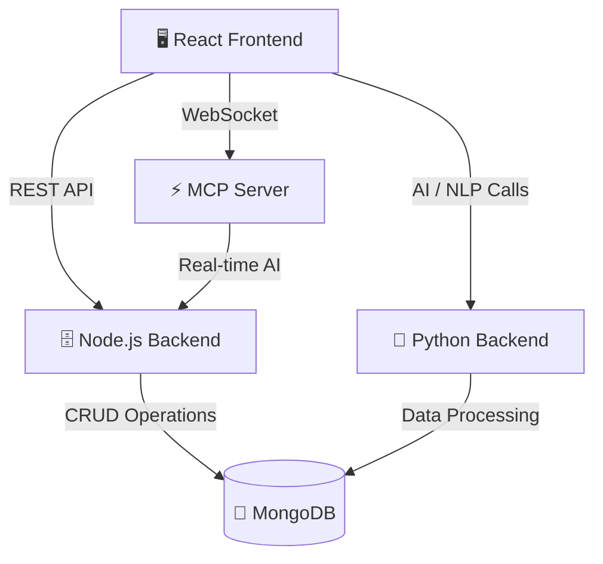

# SehathCare

# 🏥 Healthcare Management Platform


A modern, full-stack healthcare management system designed to streamline hospital operations, enhance doctor and patient experiences, and leverage AI for smarter healthcare. Built with React, Node.js, Python, MongoDB, and Docker.


## 🌟 Core Features

> **SehathCare** provides an end-to-end hospital management experience powered by cutting-edge AI and seamless microservices.

- 👩‍⚕️ **Smart Doctor Portal:** Real-time AI prescription suggestions (via MCP Server), voice-enabled registration, and appointment management.
- 🧑‍💼 **Comprehensive Admin Dashboard:** Bird's-eye view analytics, hospital statistics, and staff/patient management.
- 👨‍💻 **Efficient Frontdesk:** Streamlined patient registration and rapid appointment scheduling.
- 🤖 **Advanced AI & NLP Integration:** Custom medical knowledge graph, prescription validation, and entity/relation extraction from medical text.
- 🔊 **Voice Integration:** Voice-based patient registration and intelligent prescription input.
- 📦 **Microservices Architecture:** Decoupled React frontend, Node.js API, Python AI/NLP backend, and MCP Server.
- 🐳 **Dockerized Deployment:** Seamless setup and scaling with Docker Compose.

---

## 🗂️ Project Structure

```
Healthcare/
  client/           # React frontend
  server/           # Node.js backend (API)
  python_backend/   # Python backend (AI/NLP)
  README.md
```

---

## 💻 Tech Stack Highlights

| Domain | Technologies Used |
| :--- | :--- |
| **Frontend** | ⚛️ React, 🎨 Tailwind CSS, 🎞️ Framer Motion, 🔢 CountUp.js |
| **Backend** | 🟢 Node.js, 🚂 Express, 🔌 Socket.IO (MCP Server) |
| **AI / NLP** | 🐍 Python, ⚡ FastAPI/Flask, 🧠 NLTK, Custom Knowledge Graph |
| **Database** | 🍃 MongoDB |
| **DevOps** | 🐳 Docker, 🐙 Docker Compose, 🌐 Nginx |

---

## 🏗️ Setup & Installation

### 1. **Clone the Repository**

```bash
git clone https://github.com/yourusername/Healthcare.git
cd Healthcare
```

### 2. **Environment Variables**

- Copy and configure `.env` files for each service as needed (see sample `.env.example` in each directory).

### 3. **Build & Run with Docker**

```bash
docker-compose up --build
```

- Frontend: [http://localhost](http://localhost)
- Backend API: [http://localhost:5000](http://localhost:5000)
- Python Backend: [http://localhost:8000](http://localhost:8000)
- MCP Server: [http://localhost:4000](http://localhost:4000)
- MongoDB: `mongodb://localhost:27017`

### 4. **Access the App**

- Open your browser and go to [http://localhost](http://localhost)

---

## 🧩 System Architecture & Services Overview



### 🖥️ **Frontend (client/)**

- Built with React, Tailwind CSS, Framer Motion
- Responsive, modern UI for doctors, admins, and frontdesk
- Connects to backend and MCP server for real-time features

### 🗄️ **Backend (server/)**

- Node.js + Express REST API
- Handles authentication, appointments, prescriptions, and more
- Integrates with MongoDB

### 🧠 **Python Backend (python_backend/)**

- FastAPI/Flask for AI/NLP endpoints
- Knowledge graph, entity extraction, summarization, and more
- Communicates with Node.js backend and MCP server

### ⚡ **MCP Server (server/mcp-server/)**

- Real-time communication for doctors using Socket.IO
- Provides smart suggestions, validation, and chat for prescription generator
- Can integrate with AI/NLP backend for advanced features

### 🍃 **MongoDB**

- Stores all application data (users, appointments, prescriptions, etc.)

---

## 🩺 Example: MCP Server Usage

1. **Doctor types prescription** in the frontend
2. **Frontend sends input** to MCP server via WebSocket
3. **MCP server responds** with smart suggestions (e.g., drug names, dosages)
4. **Doctor selects suggestion** or continues typing
5. **Prescription is validated** and saved via backend API

---

## 🛠️ Development

- **Frontend:**
  ```bash
  cd client
  npm install
  npm run dev
  ```
- **Backend:**
  ```bash
  cd server
  npm install
  npm start
  ```
- **Python Backend:**
  ```bash
  cd python_backend
  pip install -r requirements.txt
  uvicorn main:app --reload --host 0.0.0.0 --port 8000
  ```
- **MCP Server:**
  ```bash
  cd server/mcp-server
  npm install
  node index.js
  ```

---

## 📚 Documentation

- API docs available at `/docs` (for Python backend if using FastAPI)
- See each service's README for more details

---

## 🤝 Contributing

Pull requests are welcome! For major changes, please open an issue first to discuss what you would like to change.

---

## 📄 License

[MIT](LICENSE)

---

## 🙏 Acknowledgements

- [React](https://react.dev/)
- [Node.js](https://nodejs.org/)
- [FastAPI](https://fastapi.tiangolo.com/)
- [MongoDB](https://www.mongodb.com/)
- [Docker](https://www.docker.com/)
- [Socket.IO](https://socket.io/)
- [Tailwind CSS](https://tailwindcss.com/)
- [Framer Motion](https://www.framer.com/motion/)

>>>>>>> 0d58466a0de4bbad748e9e5d5ecb039558f31e8c
